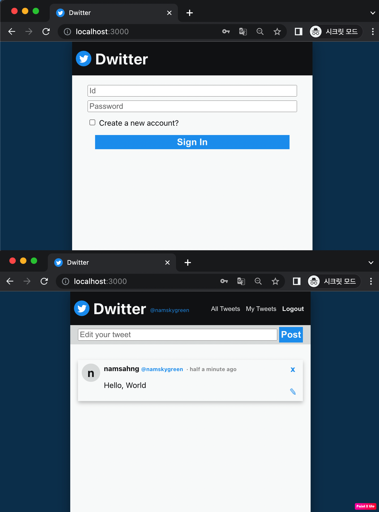

# fastapi-twitter

Changing web framework, Express.js to FAST API. Based on this
[repo](https://github.com/NamSahng/Twitter_nodejs_pjt).

## Result



## prerequisite
- Install and run MySQL server
- set server/.env
```
DB_HOST=<DB_HOST>
DB_PORT=<DB_PORT>
DB_USER=<DB_USER>
DB_PASSWORD=<DB_PASSWORD>
DB_NAME=<DB_NAME>
JWT_SECRET=<JWT_SECRET>
JWT_EXPIRES_SEC=86400
JWT_ALGORITHM=HS256
BCRYPT_SALT_ROUNDS=12
CORS_ALLOW_ORIGIN=*
```


## How to run
- Server:  
```bash
$ cd server
$ make env                  # create anaconda environment
$ conda activate <new_env>  # activate anaconda environment
$ make setup                # initial setup for the project
$ python main.py            # run server
```

- Client: Node v16.13.0
```bash
$ cd client
$ npm install
$ npm start                 # run client
```

- Swagger
    - http://127.0.0.1:9999/docs
- Redoc
    - http://127.0.0.1:9999/redoc
- openapi.json
    - http://127.0.0.1:9999/openapi.json

## Todo
- set config files
- socket
- Heroku serving
- CI/CD

## References
- Create Database: https://github.com/riseryan89/notification-api